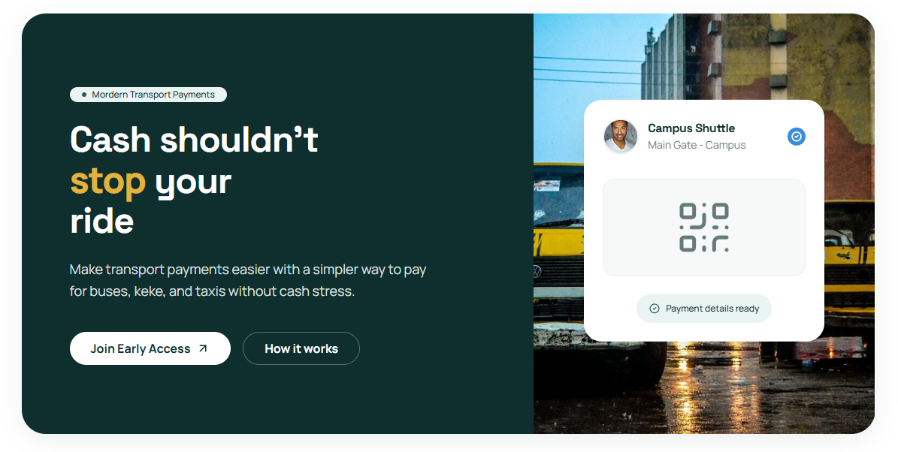

# Paylinc Landing Page

A marketing and early-access site for Paylinc that explains the product, builds trust with riders and drivers, and captures waitlist signups.

## Why This Project Exists

Digital payments in informal transit can be slow, risky, and inconsistent. This landing page introduces Paylinc as a simpler way to pay, shows how the experience works end to end, and helps people join early access before launch.

## Badges


## Table of Contents

- [What You Will Find Here](#what-you-will-find-here)
- [Tech Stack](#tech-stack)
- [Screenshots](#screenshots)
- [Project Structure](#project-structure)
- [Architecture Deep Dive](#architecture-deep-dive)
- [Prerequisites](#prerequisites)
- [Quick Start](#quick-start)
- [Available Commands](#available-commands)
- [Development Workflow](#development-workflow)
- [Build and Deployment Notes](#build-and-deployment-notes)
- [FAQ / Troubleshooting](#faq--troubleshooting)
- [Contributing](#contributing)
- [License](#license)

## What You Will Find Here

- A product-first landing experience for Paylinc.
- Clear sections for the problem, solution, trust, and target audience.
- An early-access signup flow with validation and success/error feedback.
- Responsive behavior for desktop and mobile.

## Tech Stack

- Framework: Vue 3 (Composition API, Single File Components)
- Build tool: Vite 7
- Styling: Tailwind CSS v4 with custom brand tokens
- Animation: GSAP + ScrollTrigger
- Icons: lucide-vue-next
- Observability: @vercel/analytics and @vercel/speed-insights
- Tooling: ESLint, Oxlint, Prettier

## Screenshots

Preview image:



Brand and illustration assets:
- src/assets/images/avatar.jpg
- src/assets/images/bus.png
- src/assets/images/busterminal.png
- src/assets/images/logo.png

## Project Structure

```text
.
|-- public/
|-- src/
|   |-- assets/
|   |-- components/
|   |-- composables/
|   |-- App.vue
|   |-- main.js
|-- index.html
|-- package.json
|-- vite.config.js
```

How to navigate:
- src/components/: Product sections and reusable UI blocks.
- src/assets/: Brand imagery and styles.
- src/composables/: Shared frontend behavior such as theme state.
- public/: Static files for favicon, share images, and public assets.

## Architecture Deep Dive

The page follows a conversion-oriented story flow from awareness to action:

- Discovery: visitors understand the payment problem and Paylinc promise.
- Education: sections explain how Paylinc works in simple, sequential steps.
- Trust: social proof and audience-focused messaging reduce adoption friction.
- Action: a prominent call to join early access captures intent.

The implementation supports this flow with responsive navigation, smooth transitions, and lightweight analytics for user behavior insights.

## Prerequisites

- Node.js: ^20.19.0 or >=22.12.0
- npm: bundled with Node.js

## Quick Start

```sh
npm install
npm run dev
```

Open the local Vite URL shown in your terminal.

To share a production preview locally:

```sh
npm run build
npm run preview
```

## Available Commands

```sh
npm run dev
```
Starts Vite dev server with hot reload.

```sh
npm run build
```
Builds production artifacts into dist/.

```sh

## Development Workflow

1. Install dependencies with npm install.
2. Run npm run dev for local iteration.
3. Update copy, layout, or visuals in src/components and src/assets.
4. Run npm run lint to keep code quality checks green.
5. Build with npm run build and validate with npm run preview.

## Build and Deployment Notes

- Build output: dist/
- Static entry: index.html
- Configuration: vite.config.js (Vue plugin, Tailwind integration, alias support)
- If deploying to static hosting or edge platforms, serve dist/ as the artifact.
- Analytics and speed insights are integrated and should be validated in your target environment.

## FAQ / Troubleshooting

### npm install fails with engine mismatch
Use a supported Node.js version from package.json engines (^20.19.0 or >=22.12.0).

### Dark mode toggle does not persist
Check browser localStorage availability and confirm the theme key is not blocked by privacy settings.

### Signup submissions fail
Verify network access to Formspree and confirm the configured endpoint is active.

### Styles look incorrect in development
Confirm dependencies are installed and restart the dev server after major style/config changes.

## Contributing

1. Open an issue or proposal for major messaging or UX changes.
2. Keep edits focused, and preserve the product story from problem to signup.
3. Run npm run lint and npm run build before opening a pull request.
4. Include before/after screenshots for visible UI changes.

## License

No LICENSE file is currently present in this repository.